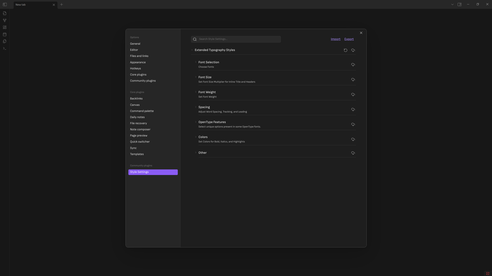
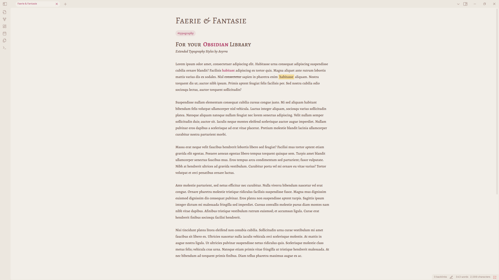
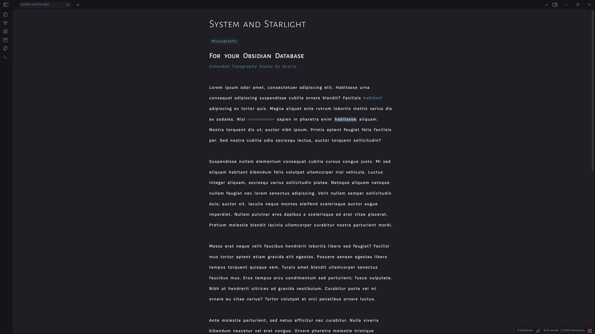
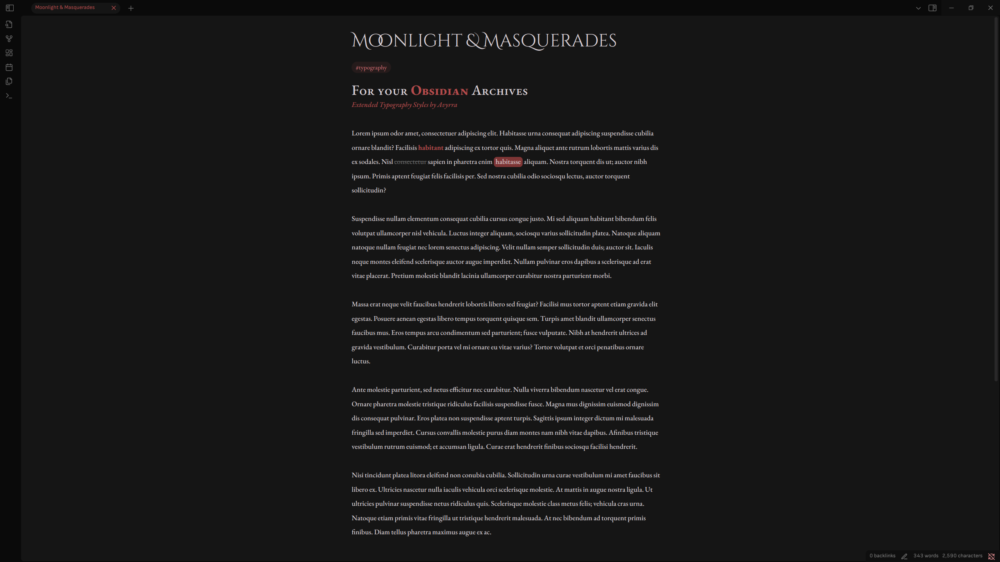

# Extended-Typography-Styles
Allows more control of typography styles in Obsidian when using the Style Settings community plugin.

## HOW TO INSTALL
Download **Extended Typography Styles.css**
- Open your Obsidian Vaults snippet folder via one of 2 ways
  - In Obsidian, open settings. Navigate to Appearance and scroll down to the css section. Click on the folder Icon.
  - In your File Browser, navigate to YourVault\.obsidian\snippets
- Move **Extended Typography Styles.css** to the snippets folder.
- In Obsidian, open settings. Naviagate to Appearance and scroll down to the css section. Enable Extended Typography Styles.
- Install and Enable Style Settings via Community Plugins > Browse > Search: Style Settings

A new menu will appear in settings called Style Settings. All Extended Typography Parameters will then be accessible from that menu.

## the .pings

## Features
- **Font Selection:** For Body, Inline Title, and Header
  - Additional option for separate fonts for all header types
- **Font size:** All sizes listed are a multiplier of your base font from the appearance settings menu
- **Font Weight:** To make your fonts thicc
  - **Bold Text:** If you like your bold text extra thicc
- **Word Spacing**
- **Tracking** (Letter Spacing)
- **Leading** (Line Spacing)
- **Baseline Spacing:** Moves all text vertically. Useful if your text doesn't line up neatly with your theme elements
- **OpenType Features**
  - **Figures:** For Body, Inline Title, and Header. Select between Default, Proportional or Tabular Width, and Lining or Oldstyle character style.
  - **Stylistic Sets:** Some fonts have stylistic sets that use different glyphs for some characters.
  - **Small Caps:** Technically works with TrueType too, but it looks better if your OpenType font supports it
- **Color Decorations:** To color various elements such as bold, italics, etc. Toggles if you don't want em.
- **Additional options:** Maybe I'll sort them, maybe I won't
  - Link Underline Toggle
  - Highlight Appearance Settings
  - Text Rendering
    - Rendering Method: Auto, Optimize for Speed, Optimize for Legibility, and Geometric Precision. Noticable effect with some fonts. Less noticable with others.
    - Smoothing Method: Tends to get filtered through your OS renderer. Saw extremely minor changes with windows. Zero changes with linux. Have not yet tested with Mac, or Mobile Devices. It's there if you need it, but you probably don't.

### Note
Parameter defaults and limitations are set by me. If the limitations are too restrictive for your tastes, you can edit them via the css file.
For best experience, ensure that all changes are made to both that YAML section and the CSS sections of the file.

## Updates!
04/09/2025 - Added Workspace Editor Snippet. Allows you to edit your workspace width and a align it left while maintaining the width.

## FAQ
- **Can I use this in my-** Yes. Yes you can. The MIT Licenses permits you to basically do whatever you want with it. Just follow the rules in the License File. So if you want to rip all the code out and use it for another project, go ahead. Want to implement it into your theme? Go ahead.

- **How can I support you and this project?** You can't. This is a personal project that I will probably forget about some day.

- **What theme are you using in your example images?** AnuPpuccin.

